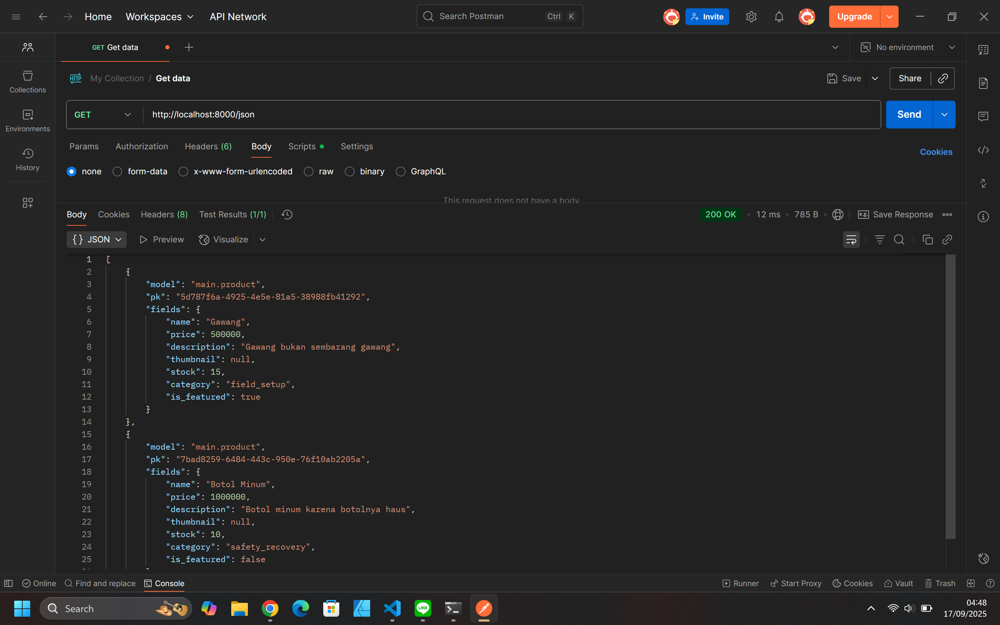
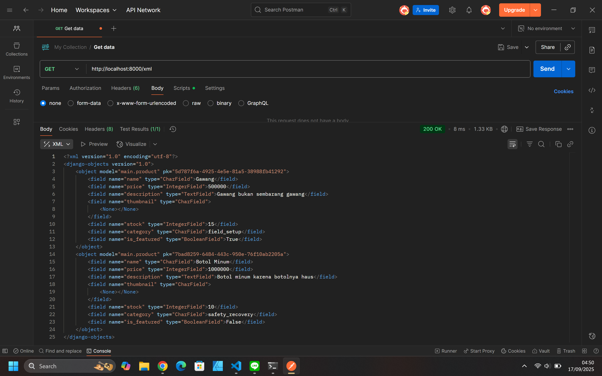
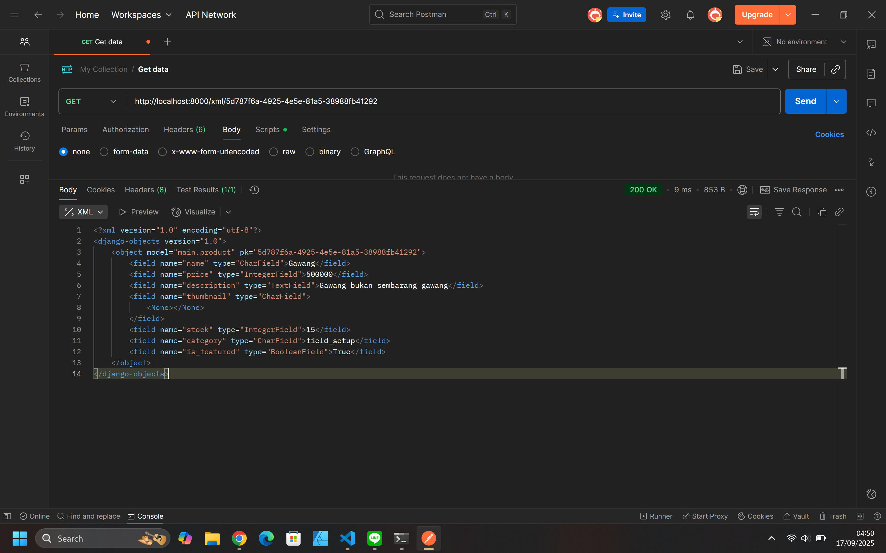
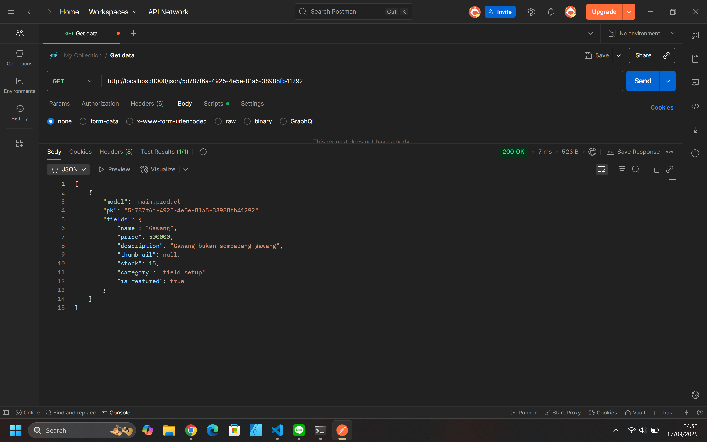

Penjelasan Tugas 3 Bolahraga
Repo: https://github.com/waldan-r/bolahraga
Web: http://waldan-rafid-bolahraga.pbp.cs.ui.ac.id

1. Data delivery diperlukan dalam pengimplementasian pemrograman platform untuk menjadi 'sistem komunikasi' data antara data mentah di database dengan user. Data delivery ini makanya dapat disajikan dalam bentuk yang mudah dipahami oleh kita sebagai user maupun program tertentu yang menjalankan perintah atau keputusan dari pengguna.

2. Menurut saya, JSON lebih mudah dipahami dibandingkan XML. Ini juga menjadi alasan kenapa JSON lebih populer yakni karena penyajian data berupa seperti dict yang cukup jelas untuk dimengerti secara cepat khususnya untuk orang yang lebih awam, sedangkan XML masih berbentuk tag elemen field yang juga menampilkan atribut lengkap beserta value yang mungkin sering dirasa terlalu banyak informasi yang disampaikan dan tidak sederhana.

3. Method is_valid() pada form Django berfungsi sebagai validasi utama form yang diisi apakah sesuai dengan requirement data yang telah diminta sebelumnya. Bisa kita lihat pada saat memodelkan class product, kita juga memberikan batasan pada tiap field pada form sehingga method ini akan mengecek apabila form sudah terisi, terisi dengan benar, dan sesuai request atau tidak.

4. csrf_token dibutuhkan pada saat membuat form di Django sebagai verifikasi bahwa request POST benar dari user (secara langsung) dan kemudian dicek ulang oleh middleware. Ini juga memastikan bahwa tidak ada request dari pihak lain selain TRUSTED_ORIGINS yang dipastikan menampung request valid user. Apabila tidak ditambahkan, program akan rentan dengan CSRF (Cross-Site Request Forgery) yang dapat mengambil alih peran user dalam request sensitif seperti mengambil data, meminta melakukan transaksi dan lain-lain tanpa sepengetahuan user.

5. Pada tugas kali ini, saya berusaha untuk tidak melihat tutorial materi sebelumnya dan mencoba mengaplikasikan apa yang sudah dilakukan pada proyek football-news. Karena pemrograman ini menggunakan framework, implementasi checklist tersebut sebenarnya cukup straight-forward mengikuti pedoman/pakem yang sudah ada. 
- Pertama untuk fungsi data delivery pada views, saya menggunakan class HttpResponse untuk memberikan respon HTTP terhadap request. Fungsi ini kemudian di-routing dengan pola url masing-masing sehingga nantinya bisa dijalankan (tiap fungsinya berbeda-beda). 
- Untuk pembuatan laman form, saya membuat berkas forms.py untuk mengetahui batasan field yang dibutuhkan untuk form ini, kemudian membuat halaman HTML yang dapat menampilkan form (add_product) sehingga bisa diisi oleh user dan juga menghubungkan dengan halaman lain (main, product_detail).
mungkin yang akan saya lakukan selanjutnya adalah membuat tampilan form dan product detail yang dinamis dan estetik sehingga tidak hanya membuat tampilan sederhana sesuai yang ada di tutorial.

6. Sama dengan tutorial sebelumnya, tutorial 2 juga sangat mudah dipahami dan sudah mulai mempercayakan mahasiswa untuk bisa lebih eksplorasi dan mengulik tiap elemen langkah pengerjaannya sehingga bisa informatif sekaligus melatih kemampuan dalam pengerjaannya. 

Berikut screenshot hasil pengaksesan URL pada Postman

Penjelasan Tugas 4: Auth, Session, Cookies
1. Framework Django memiliki AuthenticationForm yang merupakan sebuah class untuk menerima username dan password serta mengecek apakah kedua hal tersebut valid. Bisa berupa pengecekan apakah user ada, user memiliki username dengan password yang tepat, dan beberapa fungsi lain yang terhubung form dan memperbolehkan untuk akses selanjutnya.
Kelebihan dari AuthenticationForm adalah memiliki struktur yang sudah cukup lengkap sehingga bisa langsung dipakai dan bisa di-extend atau dimodifikasi sesuai dengan kebutuhan. Kekurangannya adalah ini bergantung pada username sehingga jika ingin login yang lebih aman dengan menggunakan email misalnya, kita butuh untuk membuat extension form sendiri.

2. Autentikasi adalah memeriksa keautentikan user, artinya memastikan apakah ini user yang tepat dengan validasi-validasi yang telah ditentukan. Otorisasi artinya mengecek peran atau wewenang user untuk boleh melakukan hal apa saja. Django pada kasus ini memiliki implementasi dengan penggunaan AuthenticationForm, login, logout, dan sebagainya untuk melakukan autentikasi user atau juga bisa melakukan pemodelan user, sedangkan implementasi otorisasi biasanya berupa dekoratif @login_required, @permission_required yang menentukan fungsi pada program bisa diakses oleh user yang memang memiliki wewenang melakukan aktivitas tersebut.

3. Session pada django memiliki kelebihan dalam keamanan untuk menyimpan state user karena biasanya langsung disimpan di storage setelah diisi di server. Kekurangannya berarti session memerlukan storage seperti di database atau cache
Cookie memiliki kelebihan dalam menyimpan hal yang cukup ringan seperti settingan bahasa, tema, dan sebagainya sehingga tidak membutuhkan storage server. Kelemahannya biasanya pada ukuran maksimal (batas) 4KB/cookie per domain. Cookie juga rawan dengan ancaman siber apalagi ketika berhubungan dengan kebijakan privasi.

4. Cookie default sebenarnya memiliki resiko atau potensi serangan seperti XSS yang bisa mengambil informasi cookie user dengan scripting. Namun, django sendiri sudah menyiapkan beberapa fungsi keamanan seperti HttpOnly yang akan secara default aktif, middleware proteksi CSRF yang akan menjaga request user saat beraktivitas di program, serta signed cookie session backend yang memastikan isi cookie tidak bisa diubah tanpa sepengetahuan user.

5. Pada tugas ini, lebih banyak mengimplementasi format form yang telah dipelajari pada pekan sebelumnya. Pola alur kerja yang dilakukan adalah membuat fungsi yang diinginkan terlebih dahulu pada views.py; untuk register mengimplementasikan UserCreationForm dan login dengan AuthenticationForm. Login dan logout  mengimplementasikan session dan cookie dan untuk tugas ini digunakan dalam menyimpan data last session user pada web. Tiap fungsi kemudian dihubungkan dengan templates yang telah dibuat berbentuk form serta melakukan routing pada masing-masing template sehingga tiap fungsi memiliki tampilan yang berbeda. 